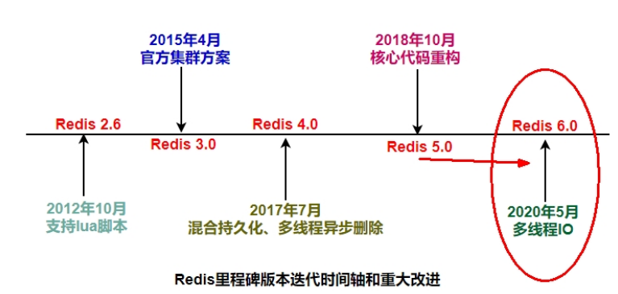
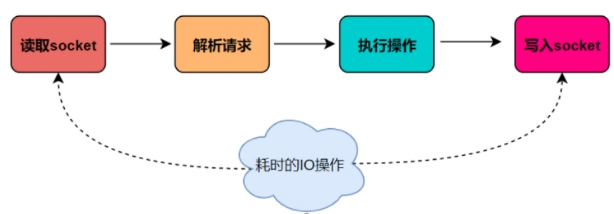

# Redis 进阶 <Badge type="warning" text="进行中" />

## Redis 资料

* 英文：https://redis.io/
* 中文：http://redis.cn/
* 官网命令：http://www.redis.cn/commands.html 、http://doc.redisfans.com/
* 查看自己 redis 的版本命令：`redis-server -v`

若使用6.X版本，安全Bug按照官网提示，升级成为6.0.8

## Redis 单线程 VS 多线程

### Redis 为什么选择单线程？

这种问法其实并不严谨，为啥这么说呢?Redis的版本很多3.x、4.x、6.x，版本不同架构也是不同的，不限定版本问是否单线程也不太严谨。

* 版本3.x ，最早版本，也就是大家口口相传的redis是单线程
* 版本4.x，严格意义来说也不是单线程，而是负责处理客户端请求的线程是单线程，但是开始加了点多线程的东西(异步删除)。
* 最新版本的6.0.x后，告别了大家印象中的单线程，用一种全新的多线程来解决问题。

Redis 几个里程碑式的重要版本：

::: tip 扩展

5.0版本是直接升级到6.0版本，对于这个激进的升级，Redis之父antirez表现得很有信心和兴奋，所以第一时间发文来阐述6.0的一些重大功能：["Redis 6.0.0 GA is out!"](·http://antirez.com/news/132)

:::

Redis 采用的是 Reactor 模式的网络模型，对于一个客户端，主线程负责一个完成的处理过程：

