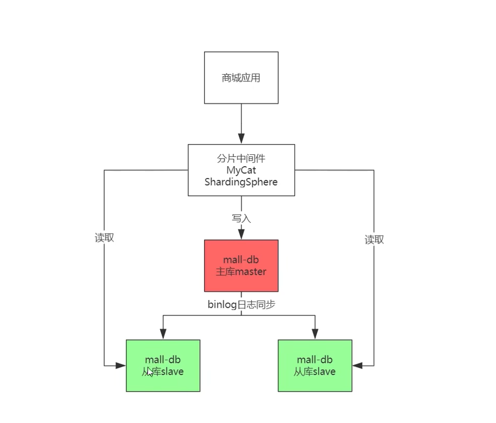
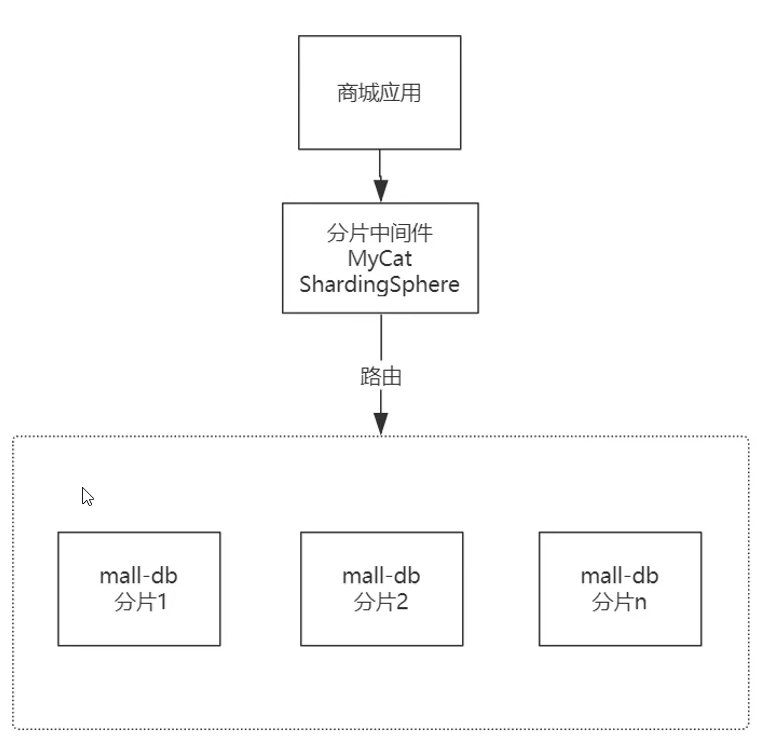
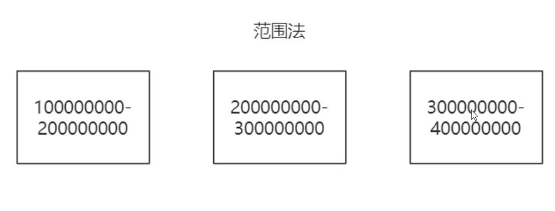
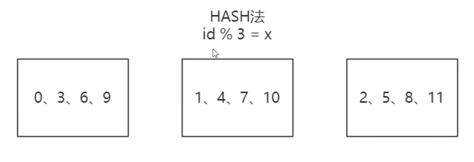
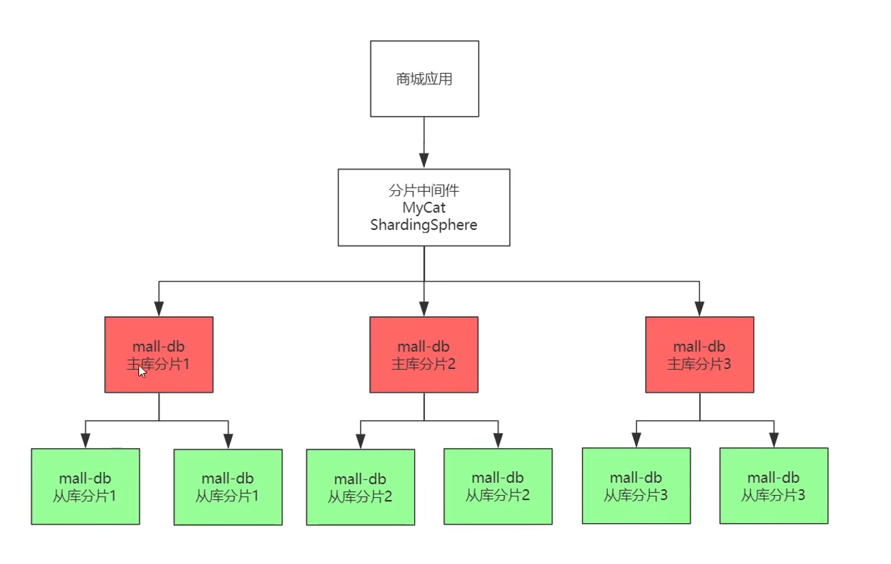

# 架构 300 讲

## 1、MySQL 集群模式

### 读写分离集群模式

架构复杂度提升，成本提高。所有节点数据均保持同步，适用于读多写少，单表不过千万的互联网应用，配合 MHA 中间件方案实现高可用性。

::: tip 提示

加入 MHA 中间件方案，当主库挂了，可以检测到，同时自动通知某个从库，提升为主库，实现故障转移，保证 MySQL 数据库的高可用性

:::

### 分库分表（分片）集群模式

架构复杂度提升，成本提高。每个节点数据是所有数据的子集，适用于十亿级数据总量大型应用，不具备高可用特性。

#### 分片算法

* 范围法

范围法结构简单，扩展容易，适合范围检索。数据分布不均匀，局部负载压力大。适用于流水账应用。

* hash 法

Hash 法分为**取模**与**一致性 Hash**。数据分配均衡，节点扩展复杂，数据迁移难度大。建议提前部署足够的节点，适用于预算充足的大型互联网应用。

### 互联网主流 MySQL 集群架构

读写分离 + 分库分表

## 2、数据垂直分表

水平分表所有的表结构都是一样的，解决的是数据量大的问题。而垂直分表则是代表将一张大表按“列”拆分为2张以上的小表，通过主外键关联来获取数据。

举例：不做垂直切分，1K大小的行需要625万页。做了垂直切分，小表64字节/行，存储小表需要39万页。

通过将重要字段单独剥离出一张小表，让每一页能够容纳更多的行，进而缩小数据扫描的范围，达到提高执行效率的目的。

**适用于单表数据量未来可能千万字段超过20个，且包含了超长的 Varchar、CLOBBLOB 等字段...**