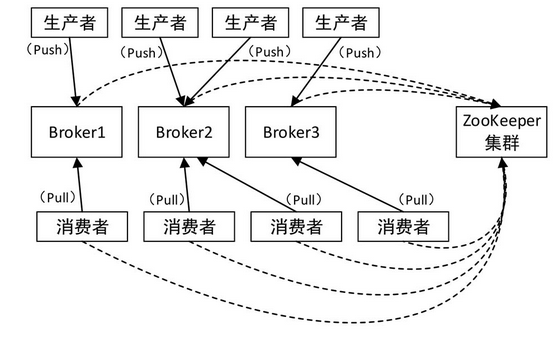
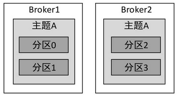
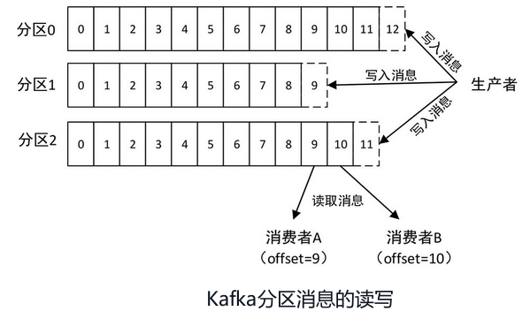
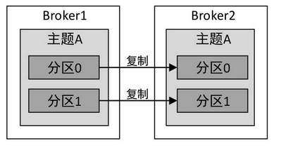
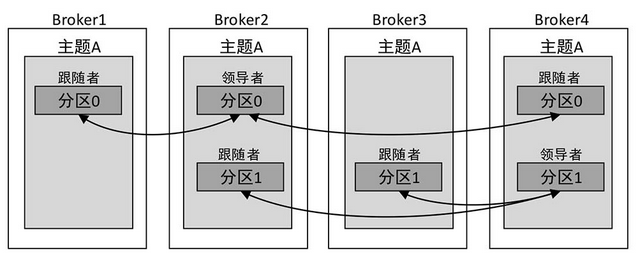
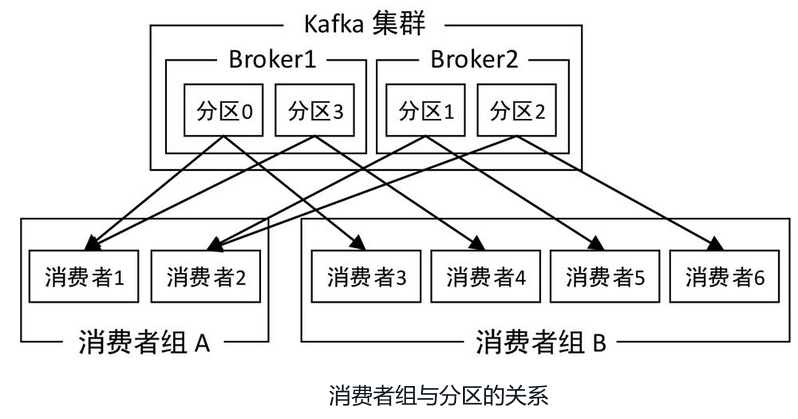
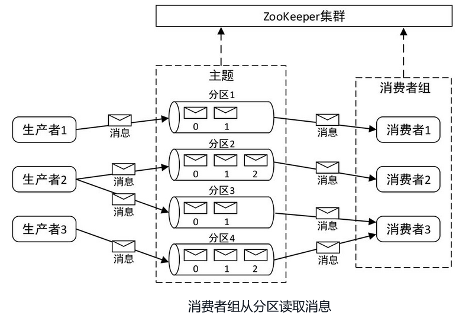
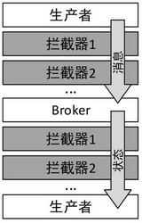

# Kafka 基础

## Kafka 基础架构理论

### 什么是 Kafka
Kafka 是一个使用 Scala 语言编写的基于 ZooKeeper 的高吞吐量低延迟的分布式发布与订阅消息系统，它可以实时处理大量消息数据以满足各种需求，比如基于 Hadoop 的批处理系统，低延迟的实时系统等。即便使用非常普通的硬件，Kafka 每秒也可以处理数百万条消息、其延迟最低只有几毫秒。
在实际开发中，Kafka 常常作为 Spark Streaming 的实时数据源，Spark Streaming 从 Kafka 中读取实时消息进行处理，保证了数据的可靠性与实时性。二者是实时消息处理系统的重要组成部分。

### 基本概念

| 概念       | 解释                                                         |
| ---------- | ------------------------------------------------------------ |
| 消息       | Kafka 的数据单元被称为消息。可以把消息看成是数据库里的一行数据或一条记录。为了提高效率，消息可以分组传输，每一组消息就是一个批次，分成批次传输可以减少网络开销。但是批次越大，单位时间内处理的消息就越大，因此要在吞吐量和时间延迟之间做出权衡。 |
| 服务器节点 | Kafka 集群包含一个或多个服务器节点，一个独立的服务器节点被称为 Broker。 |
| 主题       | 每条发布到 Kafka 集群的消息都有一个类别，这个类别被称为主题。在物理上，不同主题的消息分开存储；在逻辑上，一个主题的消息虽然保存于一个或多个 Broker 上，但用户只需指定消息的主题即可生产或消费消息，而不必关心消息存于何处。主题在逻辑上可以被认为是一个队列。每条消息都必须指定它的主题，可以简单理解为必须指明把这条消息放进哪个队列里。 |
| 分区       | 为了使 Kafka 的吞吐率可以水平扩展，物理上把主题分成一个或多个分区。创建主题时可指定分区数量。每个分区对应于一个文件夹，该文件夹下存储该分区的数据和索引文件。 |
| 生产者     | 负责发布消息到 Kafka 的 Broker，实际上属于 Broker 的一种客户端。生产者负责选择哪些消息应该分配到哪个主题内的哪个分区。默认生产者会把消息均匀地分布到特定主题的所有分区上，但在某些情况下，生产者会将消息直接写到指定的分区。 |
| 消费者     | 从 Kafka 的 Broker 上读取消息的客户端。读取消息时需要指定读取的主题，通常消费者会订阅一个或多个主题，并按照消息生成的顺序读取它们。 |


### Kafka架构
在 Kafka 中，客户端和服务器之间的通信是通过一个简单的、高性能的、与语言无关的 TCP 协议完成的。该协议进行了版本控制，并与旧版本保持向后兼容。Kafka 不仅提供 Java 客户端，也提供其他多种语言的客户端。

一个典型的 Kafka 集群中包含若干生产者(数据可以是 Web 前端产生的页面内容或者服务器日志等)、若干 Broker、若干消费者(可以是 Hadoop 集群、实时监控程序、数据仓库或其他服务)以及一个 ZooKeeper 集群。ZooKeeper 用于管理和协调 Broker。当 Kafka 系统中新增了 Broker 或者某个 Broker 故障失效时，ZooKeeper 将通知生产者和消费者。生产者和消费者据此开始与其他 Broker 协调工作。

Kafka的集群架构如下图所示。生产者使用 Push 模式将消息发送到 Broker，而消费者使用 Pull 模式从 Broker 订阅并消费消息。



### 主题与分区

Kafka通过主题对消息进行分类，一个主题可以分为多个分区，且每个分区可以存储于不同的 Broker 上，也就是说，一个主题可以横跨多个服务器。



对主题进行分区的好处是：**允许主题消息规模超出一台服务器的文件大小上限**。因为一个主题可以有多个分区，且可以存储在不同的服务器上，当一个分区的文件大小超出了所在服务器的文件大小上限时，可以动态添加其他分区，因此可以处理无限量的数据。

Kafka会为每个主题维护一个**分区日志**，**记录各个分区的消息存放情况**。消息以追加的方式写入每个分区的尾部，然后以先入先出的顺序进行读取。由于一个主题包含多个分区，<font style="color:green">因此无法在整个主题范围内保证消息的顺序，但可以保证单个分区内消息的顺序。</font>

分区中的每个记录都被分配了一个**偏移量(Offset)**，偏移量是**一个连续递增的整数值**，它**唯一标识分区中的某个记录**。而消费者只需保存该偏移量即可，当消费者客户端向 Broker 发起消息请求时需要携带偏移量。

例如，消费者向 Broker 请求主题 test 的分区0中的偏移量从20开始的所有消息以及主题 test 的分区1中的偏移量从 35 开始的所有消息。当消费者读取消息后，偏移量会线性递增。当然，消费者也可以按照任意顺序消费消息，比如读取已经消费过的**历史消息**(将偏移量重置到之前版本)。

此外，**消费者还可以指定从某个分区中一次最多返回多少条数据，防止一次返回数据太多而耗尽客户端的内存**。



对于已经发布的消息，无论这些消息是否被消费，Kafka都将会保留一段时间，具体的**保留策略**有两种：根据**时间**保留(例如7天)和根据**消息大小**保留(例如1GB)，可以进行相关参数配置，选择具体策略。

当消息数量达到配置的策略上限时，Kafka就会为节省磁盘空间而将旧消息删除。例如，设置消息保留两天，则两天内该消息可以随时被消费，但两天后该消息将被删除。Kafka的性能对数据大小不敏感，因此保留大量数据毫无压力。

每个主题也可以配置自己的保留策略，可以根据具体的业务进行设置。例如，用于跟踪用户活动的数据可能需要保留几天，而应用程序的度量指标可能只需要保留几个小时。

### 分区副本

在Kafka集群中，为了提高数据的可靠性，同一个分区可以复制多个副本分配到不同的Broker，这种方式类似于HDFS中的副本机制。如果其中一个Broker宕机，其他Broker可以接替宕机的Broker，不过生产者和消费者需要重新连接到新的Broker。Kafka分区的复制如图:



**Kafka每个分区的副本都被分为两种类型：领导者副本和跟随者副本。领导者副本只有一个，其余的都是跟随者副本。所有生产者和消费者都向领导者副本发起请求，进行消息的写入与读取，而跟随者副本并不处理客户端的请求，它唯一的任务是从领导者副本复制消息，以保持与领导者副本数据及状态的一致。**

如果领导者副本发生崩溃，就会从其余的跟随者副本中选出一个作为新的领导者副本。领导者与跟随者在Kafka集群中的分布如图:



跟随者为了与领导者保持同步，会周期性地向领导者发起获取数据的请求(Pull)，这种请求与消费者读取消息发送的请求是一样的。请求消息里包含跟随者想要获取消息的偏移量，偏移量的值随着每次请求进行递增。领导者从跟随者请求的偏移量可以知道消息复制的进度。

Kafka 的消息复制是以分区为单位的，既不是完全的同步复制，又不是完全的异步复制，而是基于 **ISR**(In-Sync Replica) 的动态复制方案。

**领导者会维护一个需要与其保持同步的副本列表(包括领导者自己)，该列表称为 ISR，且每个分区都会有一个 ISR**。如果在一定时间内(可以通过参数`replica.lag.time.max.ms`进行配置)，跟随者没有向领导者请求新的消息(可能由于网络问题)，该跟随者将被认为是不同步的，领导者会从 ISR 中将其移除，从而避免因跟随者的请求速度过慢而拖慢整体速度。而当跟随者重新与领导者保持同步，领导者会将其再次加入 ISR 中。当领导者失效时，也不会选择 ISR 中不存在的跟随者作为新的领导者。

ISR的列表数据保存在 ZooKeeper 中，每次 ISR 改变后，领导者都会将最新的 ISR 同步到 ZooKeeper 中。

### 消费者组

消费者组(Consumer Group)实际上就是一组消费者的集合。每个消费者属于一个特定的消费者组(可为每个消费者指定组名称，消费者通过组名称对自己进行标识，若不指定组名称，则属于默认的组)。

传统消息处理有两种模式：**队列模式和发布订阅模式**

* **队列模式**是指消费者可以从一台服务器读取消息，并且每个消息只被其中一个消费者消费；

- **发布订阅模式**是指消息通过广播方式发送给所有消费者。

Kafka 提供了消费者组模式，同时具备这两种(队列和发布订阅)模式的特点。

Kafka 规定，**同一消费者组内不允许多个消费者消费同一分区的消息，而不同的消费者组可以同时消费同一分区的消息**。消费者组保证了同一个分区只能被组中的一个消费者进行消费。每条消息发送到主题后，只能发送给某个消费者组中的唯一一个消费者实例(可以是同一台服务器上的不同进程，也可以是不同服务器上的进程)。



如果所有的消费者实例属于同一分组(有相同的分组名)，该过程就是传统的**队列模式**，即同一消息只有一个消费者能得到；如果所有的消费者都不属于同一分组，该过程就是**发布订阅模式**，即同一消息每个消费者都能得到。

从消费者组与分区的角度来看，整个 Kafka 的架构如图



### 数据存储机制

我们已经知道，Kafka 中的消息由主题进行分类，而主题在物理上又分为多个分区。那么分区是怎么存储数据的呢？

假设在 Broker 中有一个名为 topictest 的主题，该主题被分为4个分区，则在 Kafka 消息存储目录(配置文件`server.properties`中的属性 `log.dirs` 指定的目录)中会生成以下4个文件夹，且这4个文件夹可能分布于不同的Broker中：


在 Kafka 数据存储中，每个分区的消息数据存储于一个单独的文件夹中，分区文件夹的命名规则为“**主题名-分区编号**”，分区编号从0开始，依次递增。

**一个分区在物理上由多个 segment(段)组成**。**segment 是 Kafka 数据存储的最小单位**。每个分区的消息数据会被分配到多个segment文件中，这种将分区细分为segment的方式，方便了旧消息(旧segment)的删除和清理，达到及时释放磁盘空间的效果。

segment 文件由两部分组成：**索引文件(后缀为 .index)和数据文件(后缀为 .log)**，这两个文件一一相应，且成对出现。索引文件存储元数据，数据文件存储实际消息，索引文件中的元数据指向对应数据文件中消息的物理偏移地址。

segment 文件的命名由 20 位数字组成，同一分区中的第一个 segment 文件的命名编号从 0 开始，下一个 segment 文件的命名编号为上一个 segment 文件的最后一条消息的 offset 值。编号长度不够以 0 补充，例如：


segment 的索引文件与数据文件的对应关系如图


索引文件的**左侧为消息在该文件中的顺序(第几条消息)**，**右侧为消息在数据文件中对应的偏移地址(实际物理存储位置)**。可以看到，并不是所有的消息都会在索引文件中建立索引，而是采用每隔一定字节的数据建立一条索引，这种索引方式被称为**稀疏索引**。采用稀疏索引避免了索引文件占用过多的空间，从而提高了索引的查找速度。但缺点是，没有建立索引的消息不能一次定位到其在数据文件的物理位置，而是通过“**二分法**”定位到与其最近的消息的位置(小于等于需要查找的消息位置中的最大值)，然后顺序进行扫描(此时顺序扫描的范围已经被缩小了)，直到找到需要查找的消息。

::: warning 提醒

Kafka 的数据有消息边界，通过消息边界确定数据范围

:::

我们已经知道，消费者是通过offset值查找消息的，以上两个图为例，如果需要查找 offset=170413 的消息，Kafka 的查找步骤如下：


1. 通过 offset 值定位到索引文件。索引文件`00000000000000170410.index`的起始 offset 值为 `170410+1=170411`，索引文件 `00000000000000258330.index` 的起始 offset 值为 `258330+1=258331`。根据二分查找法，可以快速定位到 offset 值为 170413 的消息的索引文件为 `00000000000000170410.index`。

2. 通过索引文件查询消息物理偏移地址。首先根据 offset 值查找到消息顺序，offset 值为 170413 的消息在索引文件 `00000000000000170410.index`中 的消息顺序为 `170413-170410=3`。然后根据消息顺序查找(二分法)到消息在数据文件的物理偏移地址，消息顺序为 3 的消息对应的物理偏移地址为 256。

3. 通过物理偏移地址定位到消息内容。根据查找到的物理偏移地址，到数据文件 `00000000000000170410.log` 中查找对应的消息


## 搭建 Kafka 集群

:::danger 未完待续...


:::

## Java API 操作 Kafka

### 依赖

```xml
<dependency>
    <groupId>org.apache.kafka</groupId>
    <artifactId>kafka-clients</artifactId>
    <version>2.0.0</version>
</dependency>
```

### 创建生产者

```java
import org.apache.kafka.clients.producer.*;
import org.apache.kafka.common.serialization.IntegerSerializer;
import org.apache.kafka.common.serialization.StringSerializer;

import java.util.Properties;

public class Producer {
    public static void main(String[] args) {
        Properties properties = new Properties();
        // 设置生产者Broker服务器地址
        properties.setProperty(ProducerConfig.BOOTSTRAP_SERVERS_CONFIG,"centos7001:9092,centos7002:9092,centos7003:9092");
        // 设置序列化key程序类
        properties.setProperty(ProducerConfig.KEY_SERIALIZER_CLASS_CONFIG, StringSerializer.class.getName());
        // 设置序列化value程序类，不一定是Integer，可以是String
        properties.setProperty(ProducerConfig.VALUE_SERIALIZER_CLASS_CONFIG, IntegerSerializer.class.getName());

        // 定义消息生产者
        KafkaProducer<String, Integer> kafkaProducer = new KafkaProducer<>(properties);

        // 发送消息方式，消息发送给服务器即发送完成，而不管消息是否送达
        for (int i = 0; i < 10; i++) {
            kafkaProducer.send(new ProducerRecord<String,Integer>("topictest","hello kafka "+i,i));
        }

        kafkaProducer.close();

    }
}

```

上述代码中，生产者对象 KafkaProducer 的 send() 方法负责发送消息，并将消息记录 ProducerRecord 对象作为参数，因此需要先创建 ProducerRecord 对象。

ProducerRecord 有多个构造方法，这里使用其中一种构造方法，该构造方法的第一个参数为目标主题的名称，第二个参数为消息的键(key)，第三个参数为消息的值(value)，即具体的消息内容。此处的键为字符串类型，值为整数(也可以为字符串)。但消息键值的类型必须与序列化程序类和生产者对象 Producer 中规定的类型相匹配。

上述这种消息发送方式的特点是：**消息发送给服务器即发送完成，而不管消息是否送达。**因为 Kafka 的高可用性，在大多数情况下，消息都可以正常送达，当然也不排除丢失消息的情况。所以，如果发送结果并不重要，那么可以使用这种消息发送方式，例如记录消息日志或记录不太重要的应用程序日志。

除了上述消息发送方式外，还有两种消息发送方式：同步发送和异步发送。

#### 同步发送

使用生产者对象的 send() 方法发送消息，会返回一个 Future 对象，调用 Future 对象的 get() 方法，然后等待结果，就可以知道消息是否发送成功。如果服务器返回错误，get() 方法就会抛出异常；如果没有发生错误，就会得到一个 RecordMetadata 对象，可以利用该对象获取消息的偏移量等。同步发送消息的简单代码如下：

```java
for (int i = 0; i < 10; i++) {
    try {
        // RecordMetadata对象，可以利用该对象获取消息的偏移量等
        RecordMetadata recordMetadata = kafkaProducer.send(new ProducerRecord<String, Integer>("topictest", "hello kafka " + i, i)).get();
    } catch (Exception e) {
       e.printStackTrace();
    }
}
```

#### 异步发送

使用生产者对象的 send() 方法发送消息时，可以指定一个**回调方法**，服务器返回响应信息时会调用该方法。可以在该方法中对一些异常信息进行处理，比如记录错误日志，或者把消息写入“错误消息”文件以便日后分析，示例代码如下：

```java
for (int i = 0; i < 10; i++) {
    try {
       kafkaProducer.send(new ProducerRecord<String, Integer>("topictest", "hello kafka " + i, i),new Callback(){
           @Override
           public void onCompletion(RecordMetadata recordMetadata, Exception e) {
               if (e!=null){
                   e.printStackTrace();
               }
           }
       });

    } catch (Exception e) {
        e.printStackTrace();
    }
}
```

上述代码中，为了使用回调方法，在 send() 方法中加入了一个参数，该参数是实现了 Callback 接口的匿名内部类。Callback 接口只有一个 onCompletion() 方法，该方法有两个参数：

第一个参数为 RecordMetadata 对象，从该对象可以获取消息的偏移量等内容；

第二个参数为 Exception 对象。如果Kafka返回一个错误，onCompletion() 方法就会抛出一个非空异常，可以从 Exception 对象中获取这个异常信息，从而对异常进行处理。

### 创建消费者

```java
import org.apache.kafka.clients.consumer.ConsumerConfig;
import org.apache.kafka.clients.consumer.ConsumerRecord;
import org.apache.kafka.clients.consumer.ConsumerRecords;
import org.apache.kafka.clients.consumer.KafkaConsumer;
import org.apache.kafka.common.serialization.IntegerDeserializer;
import org.apache.kafka.common.serialization.StringDeserializer;

import java.time.Duration;
import java.util.Arrays;
import java.util.Properties;

public class Consumer {
    public static void main(String[] args) {
        Properties properties = new Properties();
        // 设置消费者Broker服务器地址
        properties.setProperty(ConsumerConfig.BOOTSTRAP_SERVERS_CONFIG,"centos7001:9092,centos7002:9092,centos7003:9092");
        // 设置反序列化key程序类，与生产者对应
        properties.setProperty(ConsumerConfig.KEY_DESERIALIZER_CLASS_CONFIG, StringDeserializer.class.getName());
        // 设置反序列化value程序类，与生产者对应
        properties.setProperty(ConsumerConfig.VALUE_DESERIALIZER_CLASS_CONFIG, IntegerDeserializer.class.getName());
        // 设置消费者组ID，组名称相同的消费者属于同一个消费者组
        // 创建不属于任何一个消费者组的消费者也可以，但是不常见。
        properties.setProperty(ConsumerConfig.GROUP_ID_CONFIG,"groupID-1");

        // 创建消费者
        KafkaConsumer<String, Integer> kafkaConsumer = new KafkaConsumer<>(properties);

        // 设置消费者读取的主题名称，可以设置多个
        kafkaConsumer.subscribe(Arrays.asList("topictest"));

        // 不停读取消息
        while(true){
            // 拉取消息，并设置超时时间为10秒
            ConsumerRecords<String, Integer> records = kafkaConsumer.poll(Duration.ofSeconds(10));
            // 打印消息
            for (ConsumerRecord<String, Integer> record : records) {
                System.out.println("key: "+record.key()+",value: "+record.value()+", partition: "+record.partition()+",offset: "+record.offset());
            }
        }
    }
}
```

### 运行程序

生产者与消费者代码编写完毕后，就可以运行程序了，运行步骤如下：

1. 运行消费者程序 MyConsumer.java，对消息进行监听。

2. 运行生产者程序 MyProducer.java，向Kafka发送消息。

3. 查看接收到的消息内容

消息发送完毕后，在控制台中查看输出结果，可以看到以下输出内容：

```
key: hello kafka 1,value: 1, partition: 0,offset: 25
key: hello kafka 2,value: 2, partition: 0,offset: 26
key: hello kafka 4,value: 4, partition: 0,offset: 27
key: hello kafka 5,value: 5, partition: 0,offset: 28
key: hello kafka 7,value: 7, partition: 0,offset: 29
key: hello kafka 8,value: 8, partition: 0,offset: 30
key: hello kafka 0,value: 0, partition: 1,offset: 17
key: hello kafka 3,value: 3, partition: 1,offset: 18
key: hello kafka 6,value: 6, partition: 1,offset: 19
key: hello kafka 9,value: 9, partition: 1,offset: 20
```

key 与 value 的值可以代表生产者发送消息的顺序，offset 的值可以代表消费者消费消息的顺序，partition 的值为消息所在的分区编号。上述输出的消息共来源于两个分区，分区编号分别为 0 和 1。

进一步分析上述输出内容可以发现，消费者消费的消息总体来说是无序的，但是针对同一个分区(分区编号相同)的消息消费却是有序的。而生产者是按照 0～9 的顺序进行消息发送的。

### 验证消息消费顺序

在 IDEA 中先运行消费者程序 Consumer.java，再将 `Consumer.java` 改为 `Consumer2.java`，运行 `Consumer2.java` 程序，此时就有两个消费者共同消费消息，并且这两个消费者属于同一个组，组 ID 为 groupid-1 (在消费者程序 `Consumer.java` 中已对组ID进行了定义)。然后重新运行生产者程序 `Producer.java` 发送消息，发送完毕后，查看两个消费者程序的控制台的输出结果。

```
# Consumer
key: hello kafka 1,value: 1, partition: 0,offset: 31
key: hello kafka 2,value: 2, partition: 0,offset: 32
key: hello kafka 4,value: 4, partition: 0,offset: 33
key: hello kafka 5,value: 5, partition: 0,offset: 34
key: hello kafka 7,value: 7, partition: 0,offset: 35
key: hello kafka 8,value: 8, partition: 0,offset: 36

# Consumer2
key: hello kafka 0,value: 0, partition: 1,offset: 21
key: hello kafka 3,value: 3, partition: 1,offset: 22
key: hello kafka 6,value: 6, partition: 1,offset: 23
key: hello kafka 9,value: 9, partition: 1,offset: 24
```

从上述两个消费者的输出结果可以看到，10 条消息来自于两个分区：分区 0 和分区 1。

分区1的消息被消费者一所消费，分区 0 的消息被消费者二所消费。结合各自输出结果的 offset 值可以看出，每个消费者又都是按顺序消费的。因为 Kafka 仅仅支持分区内的消息按顺序消费，并不支持全局(同一主题的不同分区之间)的消息按顺序消费。

kafka 规定，同一个分区内的消息只能被同一个消费者组中的一个消费者消费。而本例中的两个消费者正是属于同一个消费者组，且主题 topictest 有两个分区，所以需要两个消费者才能各自按顺序消费。

::: tip 建议

1. 同一个消费者组内，消费者数量不能多于分区数量，否则多出的消费者不能消费消息。
2. 如果需要全局都按顺序消费消息，那么可以通过给一个主题只设置一个分区的方法实现，但是这也意味着一个分组只能有一个消费者。

:::

## Kafka 生产者拦截器

Kafka生产者拦截器主要用于在消息发送前对消息内容进行定制化修改，以便满足相应的业务需求，也可用于在消息发送后获取消息的发送状态、所在分区和偏移量等信息。同时，用户可以在生产者中指定多个拦截器形成一个拦截器链，生产者会根据指定顺序先后调用。

Kafka生产者拦截器主要用于在消息发送前对消息内容进行定制化修改，以便满足相应的业务需求，也可用于在消息发送后获取消息的发送状态、所在分区和偏移量等信息。同时，用户可以在生产者中指定多个拦截器形成一个拦截器链，生产者会根据指定顺序先后调用。

生产者拦截器的访问流程如图



这里使用两个拦截器组成一个拦截器链：

1. 第一个拦截器为**时间戳拦截器**，作用是在消息发送之前修改消息的内容，在消息最前边加入当前时间戳；
2. 第二个拦截器为**消息发送状态拦截器**，作用是统计发送成功和失败的消息数。

### 创建时间戳拦截器

```java
import org.apache.kafka.clients.producer.ProducerConfig;
import org.apache.kafka.clients.producer.ProducerInterceptor;
import org.apache.kafka.clients.producer.ProducerRecord;
import org.apache.kafka.clients.producer.RecordMetadata;
import java.util.Map;

public class TimeInterceptor implements ProducerInterceptor<String, String> {
    /**
     * 此方法在消息发送前调用
     * 对原消息记录进行修改，在消息内容最前边添加时间戳
     *
     * @param producerRecord
     * @return 修改后的消息记录
     */
    @Override
    public ProducerRecord<String, String> onSend(ProducerRecord<String, String> producerRecord) {
        System.out.println("TimeInterceptor------onSend 方法被调用");
        // 创建一条新的消息记录，将时间戳加入消息内容的最前边
        return new ProducerRecord<String, String>(producerRecord.topic(), producerRecord.key(),
                System.currentTimeMillis() + "," + producerRecord.value().toString());
    }

    /**
     * 此方法在消息发送完毕后调用
     * 当发送到服务器的记录已被确认，或记录发送失败时，将调用此方法
     * @param recordMetadata
     * @param e
     */
    @Override
    public void onAcknowledgement(RecordMetadata recordMetadata, Exception e) {
        System.out.println("TimeInterceptor------onAcknowledgement 方法被调用");
    }

    /**
     * 当拦截器关闭时调用此方法
     */
    @Override
    public void close() {
        System.out.println("TimeInterceptor------close 方法被调用");
    }

    /**
     * 获取生产者配置信息
     * @param map
     */
    @Override
    public void configure(Map<String, ?> map) {
        System.out.println(ProducerConfig.BOOTSTRAP_SERVERS_CONFIG);
    }
}

```

### 创建发送状态拦截器

```java
import org.apache.kafka.clients.producer.ProducerConfig;
import org.apache.kafka.clients.producer.ProducerInterceptor;
import org.apache.kafka.clients.producer.ProducerRecord;
import org.apache.kafka.clients.producer.RecordMetadata;
import java.util.Map;

public class CounterInterceptor implements ProducerInterceptor<String, String> {

    /**
     * 发送成功的消息数量
     */
    private int successCounter = 0;
    /**
     * 发送失败的消息数量
     */
    private int errorCounter = 0;

    /**
     * 此方法在消息发送前调用
     * 此处不做处理
     *
     * @param producerRecord
     * @return 修改后的消息记录
     */
    @Override
    public ProducerRecord<String, String> onSend(ProducerRecord<String, String> producerRecord) {
        System.out.println("CounterInterceptor------onSend 方法被调用");
        return producerRecord;
    }

    /**
     * 此方法在消息发送完毕后调用
     * 当发送到服务器的记录已被确认，或记录发送失败时，将调用此方法
     *
     * @param recordMetadata
     * @param e
     */
    @Override
    public void onAcknowledgement(RecordMetadata recordMetadata, Exception e) {
        System.out.println("CounterInterceptor------onAcknowledgement 方法被调用");
        // 统计成功和失败的次数
        if (e == null) {
            successCounter++;
        } else {
            errorCounter++;
        }
    }

    /**
     * 当生产者关闭时调用此方法，可以在此将结果进行持久化保存
     */
    @Override
    public void close() {
        System.out.println("CounterInterceptor------close 方法被调用");
        // 打印统计结果
        System.out.println("发送成功的消息数量：" + successCounter);
        System.out.println("发送失败的消息数量：" + errorCounter);
    }

    /**
     * 获取生产者配置信息
     *
     * @param map
     */
    @Override
    public void configure(Map<String, ?> map) {
        System.out.println(ProducerConfig.BOOTSTRAP_SERVERS_CONFIG);
    }
}

```

### 创建生产者

```java
import org.apache.kafka.clients.producer.KafkaProducer;
import org.apache.kafka.clients.producer.ProducerConfig;
import org.apache.kafka.clients.producer.ProducerRecord;
import org.apache.kafka.common.serialization.StringSerializer;
import java.util.Arrays;
import java.util.Properties;

public class InterceptorProducer {
    public static void main(String[] args) {
        Properties properties = new Properties();
        // 设置生产者Broker服务器地址
        properties.setProperty(ProducerConfig.BOOTSTRAP_SERVERS_CONFIG, "centos7001:9092,centos7002:9092,centos7003:9092");
        // 设置序列化key程序类
        properties.setProperty(ProducerConfig.KEY_SERIALIZER_CLASS_CONFIG, StringSerializer.class.getName());
        // 设置序列化value程序类
        properties.setProperty(ProducerConfig.VALUE_SERIALIZER_CLASS_CONFIG, StringSerializer.class.getName());

        // 设置拦截器链,需指定全路径
        properties.put(ProducerConfig.INTERCEPTOR_CLASSES_CONFIG, Arrays.asList("cn.bithachi.demo.kafka.interceptor.CounterInterceptor", "cn.bithachi" +
                ".demo.kafka.interceptor.TimeInterceptor"));

        // 定义消息生产者
        KafkaProducer<String, String> kafkaProducer = new KafkaProducer<>(properties);


        // 发送消息方式，消息发送给服务器即发送完成，而不管消息是否送达
        for (int i = 0; i < 5; i++) {
            kafkaProducer.send(new ProducerRecord<String,String>("topictest","hello kafka "+i));
        }

        // 调用该方法将触发拦截器的close()方法
        kafkaProducer.close();

    }
}

```

### 创建消费者

```java
import org.apache.kafka.clients.consumer.ConsumerConfig;
import org.apache.kafka.clients.consumer.ConsumerRecord;
import org.apache.kafka.clients.consumer.ConsumerRecords;
import org.apache.kafka.clients.consumer.KafkaConsumer;
import org.apache.kafka.common.serialization.StringDeserializer;

import java.time.Duration;
import java.util.Arrays;
import java.util.Properties;

public class InterceptorConsumer {
    public static void main(String[] args) {
        Properties properties = new Properties();
        // 设置消费者Broker服务器地址
        properties.setProperty(ConsumerConfig.BOOTSTRAP_SERVERS_CONFIG,"centos7001:9092,centos7002:9092,centos7003:9092");
        // 设置反序列化key程序类，与生产者对应
        properties.setProperty(ConsumerConfig.KEY_DESERIALIZER_CLASS_CONFIG, StringDeserializer.class.getName());
        // 设置反序列化value程序类，与生产者对应
        properties.setProperty(ConsumerConfig.VALUE_DESERIALIZER_CLASS_CONFIG, StringDeserializer.class.getName());
        // 设置消费者组ID，组名称相同的消费者属于同一个消费者组
        // 创建不属于任何一个消费者组的消费者也可以，但是不常见。
        properties.setProperty(ConsumerConfig.GROUP_ID_CONFIG,"groupID-1");

        // 创建消费者
        KafkaConsumer<String, String> kafkaConsumer = new KafkaConsumer<>(properties);

        // 设置消费者读取的主题名称，可以设置多个
        kafkaConsumer.subscribe(Arrays.asList("topictest"));

        // 不停读取消息
        while(true){
            // 拉取消息，并设置超时时间为10秒
            ConsumerRecords<String, String> records = kafkaConsumer.poll(Duration.ofSeconds(10));
            // 打印消息
            for (ConsumerRecord<String, String> record : records) {
                System.out.println(record.value());
            }
        }

    }
}

```

### 验证测试

先运行消费者，再运行生产者。生产者控制台输出：

```
bootstrap.servers
bootstrap.servers
CounterInterceptor------onSend 方法被调用
TimeInterceptor------onSend 方法被调用
CounterInterceptor------onSend 方法被调用
TimeInterceptor------onSend 方法被调用
CounterInterceptor------onSend 方法被调用
TimeInterceptor------onSend 方法被调用
CounterInterceptor------onSend 方法被调用
TimeInterceptor------onSend 方法被调用
CounterInterceptor------onSend 方法被调用
TimeInterceptor------onSend 方法被调用
CounterInterceptor------onAcknowledgement 方法被调用
TimeInterceptor------onAcknowledgement 方法被调用
CounterInterceptor------onAcknowledgement 方法被调用
TimeInterceptor------onAcknowledgement 方法被调用
CounterInterceptor------onAcknowledgement 方法被调用
TimeInterceptor------onAcknowledgement 方法被调用
CounterInterceptor------onAcknowledgement 方法被调用
TimeInterceptor------onAcknowledgement 方法被调用
CounterInterceptor------onAcknowledgement 方法被调用
TimeInterceptor------onAcknowledgement 方法被调用
CounterInterceptor------close 方法被调用
发送成功的消息数量：5
发送失败的消息数量：0
TimeInterceptor------close 方法被调用
```

消费者控制台输出：

```
1661498227137,hello kafka 0
1661498227270,hello kafka 2
1661498227270,hello kafka 4
1661498227270,hello kafka 1
1661498227270,hello kafka 3
```

::: tip 由上述输出信息结合拦截器的调用顺序可以总结出：

1. 在每条消息发送之前，两个拦截器会依次调用 `onSend()` 方法；
2. 在每条消息发送之后，两个拦截器会依次调用 `onAcknowledgement()` 方法；
3. 在生产者关闭时，两个拦截器会依次调用 `close()` 方法。

:::
